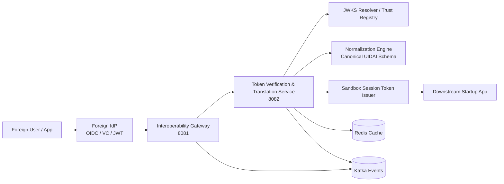

**Assignment: Technical Architect — UIDAI Technology Centre, Bengaluru**  
**Candidate:** Rohith Pavithran  
**Date:** 11th April 2026

***

## 1) Cross-Border Trust Broker — System Design

### Objective

The goal here is to design a **Sandbox Interoperability Gateway** that lets a foreign citizen authenticate using their home identity provider and still work seamlessly with applications inside the UIDAI Sandbox.

At a high level, this acts as a **trust broker** — but in practice, that just means we take something we don’t fully control (a foreign identity), verify it rigorously, reshape it into something we understand, and only then let it into our system.

One thing worth calling out early: most failures in systems like this don’t come from happy-path flows — they come from edge cases in trust, key rotation, or inconsistent identity payloads. So the design leans heavily toward being defensive.

***

### High-Level Architecture

This follows a **federated trust-broker pattern**, but the intent is not to over-engineer it — just to keep concerns clean.

A typical flow looks like this:

A user authenticates with a foreign IdP (OIDC, OAuth2, or sometimes a VC flow). That token hits the **Interoperability Gateway**, which does the bare minimum — basic validation, rate limiting, and routing. It shouldn’t try to be smart.

The real work happens in the **Token Verification & Translation Service**. This is where we resolve keys (via JWKS), verify signatures, validate claims, and then normalize the identity.

Only after all of that do we issue a **Sandbox Session Token**.

Kafka and Redis sit in the background — Kafka for audit and async work, Redis for caching trust artifacts and keeping things fast.

👉 In practice, keeping the gateway thin is important. We’ve seen gateway layers become bottlenecks when too much logic creeps in.

***

### Protocols Bridged

The gateway supports multiple identity standards — mostly because in the real world, you don’t get to choose what partners use.

- **OIDC / OAuth2** (this will be the majority)
- **JWT-based federation**
- **Verifiable Credentials / DID** (still emerging, but important)
- Optional **SAML** for legacy integrations (you’ll need it sooner or later)

There’s a temptation to standardize aggressively, but in reality, abstraction at the gateway layer is what keeps the system maintainable.

***

### Identity Normalization Strategy

This is where things usually get messy.

Different countries structure identity data very differently — name order, address formats, even basic fields like date of birth can vary wildly. If we try to hardcode mappings, it becomes unmaintainable very quickly.

So instead, the system uses a **config-driven transformation pipeline**.

There’s a canonical schema inside the sandbox, and everything maps into that. Country-specific logic lives outside the core system as configuration — adapter packs, mapping rules, and schema versions.

In theory, this sounds clean. In practice, you still need guardrails — validation thresholds, fallback handling, and sometimes rejecting incomplete identities altogether.

A few typical transformations:

- combining `given_name` and `family_name`
- normalizing `dob` into ISO format
- breaking down unstructured addresses
- mapping assurance levels into something meaningful locally

👉 One thing we’ve seen in similar systems: normalization failures are often silent unless you explicitly track them. So observability here matters more than people expect.

***

### Mermaid Diagram



***

### Operational Notes

The infrastructure stack (Kafka, Redis, Docker/Kubernetes) fits this design well.

That said, the real operational challenge isn’t deployment — it’s **managing trust anchors and keeping them fresh**. JWKS endpoints go down, keys rotate unexpectedly, and latency spikes can cascade.

Designing for those realities upfront saves a lot of pain later.

***

## 2) Trust Anchor Exchange — Core Backend Logic

### Goal

The job of this service is simple on paper: take a foreign token, verify it, normalize it, and issue a sandbox token.

In reality, this is the most security-sensitive part of the system — and also where subtle bugs can create serious trust issues.

***

### Core Security Design

A few non-negotiables here:

- Always resolve keys using `kid`
- Always verify signatures before doing anything else
- Always validate issuer, audience, and expiry

Sounds obvious, but shortcuts here are where systems tend to fail.

Also, key rotation is not an edge case — it’s a normal operating condition. So caching needs to be smart, not just fast.

***

### Suggested Endpoint

`POST /api/v1/token/translate`

#### Request

```json
{
  "foreignIdentityToken": "eyJhbGciOiJSUzI1NiIsImtpZCI6IjEyMyJ9..."
}
```

#### Response

```json
{
  "sandboxSessionToken": "eyJhbGciOiJSUzI1NiIs...",
  "subject": "federated-user-001",
  "assuranceLevel": "high",
  "expiresIn": 900
}
```

***

### Processing Steps

The flow itself is straightforward, but each step needs to be strict:

Parse the JWT, extract `kid`, fetch the correct key, verify the signature, validate claims, normalize the payload, and finally issue a new token.

Nothing in this pipeline should be “best effort.” Either the token is valid, or it isn’t.

***

### Error Handling

This is where real-world behavior matters more than theory.

- If JWKS is temporarily down, cached keys can help — but only if they’re still valid
- If a key rotation happens and you don’t handle it well, you’ll start rejecting legitimate users
- If you accept a token without proper verification, you’ve effectively broken your trust boundary

👉 Most production issues here tend to come from **JWKS instability or cache staleness**, not from core logic bugs.

***

### Implementation Shape

The service should be cleanly layered:

Controller → verification → trust client → normalization → token issuance

Keeping these concerns separate makes it much easier to debug issues when something inevitably goes wrong.

The multi-module Spring Boot setup (gateway + token service + shared module) is a good fit for this separation.

***

## 3) Scaling Crucible — Technical Judgment

### What Breaks First at 15,000 RPS

At this scale, things don’t fail all at once — they degrade in layers.

The first signs of trouble are usually:

- too many synchronous JWKS calls
- crypto operations starting to dominate CPU
- normalization logic adding latency

If left unchecked, these compound pretty quickly.

***

### Re-architecture / Tuning Plan

**Cache aggressively — but don’t get lazy about it**

Caching JWKS and trust metadata is essential. But stale caches are just as dangerous as no cache, so TTLs and background refresh matter.

**Keep the hot path tight**

The request path should only include what’s absolutely necessary: verification, normalization, and token issuance. Everything else (audit, enrichment) should go async via Kafka.

**Scale independently**

Gateway and verification services behave very differently under load. Treat them separately when scaling — Kubernetes HPA helps, but only if metrics are chosen carefully.

**Crypto is expensive — plan for it**

Signature verification and signing are not cheap at high RPS. Reusing parsed keys and avoiding repeated JWKS lookups makes a noticeable difference.

**Expect external instability**

JWKS endpoints, IdPs — they will fail or slow down. Circuit breakers, rate limits, and backpressure aren’t optional at this scale.

👉 One practical observation: systems like this usually don’t fail because of internal logic — they fail because of dependencies behaving unpredictably.

***

## Conclusion

This design aims to be practical more than perfect.

It keeps the system modular, avoids hardcoded assumptions about identity formats, and builds around the reality that trust verification is both critical and fragile.

Kafka, Redis, and Kubernetes provide the backbone for scaling, but the real strength of the system is in how it handles uncertainty — unknown identity formats, changing keys, and unreliable external systems.

If there’s one guiding principle here, it’s this: **trust should always be explicit, never assumed.**

***

This design gives UIDAI a **secure, scalable, and extensible trust-broker layer** for cross-border identity interoperability.

It:

- supports multiple identity standards
- avoids brittle hardcoded mappings
- keeps trust verification strict and explicit
- scales using Kafka, Redis, and Kubernetes

Most importantly, it treats **trust as a first-class concern** — everything is verified, cached carefully, and rejected safely when needed.

***

## Code Repository

**GitHub:** [https://github.com/rohithtp/uidai-sandbox-trust-broker](https://github.com/rohithtp/uidai-sandbox-trust-broker)