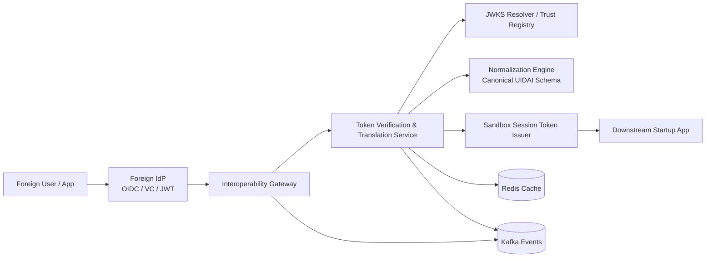

**Candidate:** Rohith Pavithran  | **Role:** Technical Architect | **Repository**  [https://github.com/rohithtp/uidai-sandbox-trust-broker](https://github.com/rohithtp/uidai-sandbox-trust-broker)

***

## 1) Problem Context

The problem statement:

> Allow a foreign citizen to authenticate using their home identity provider and interact with applications inside the UIDAI Sandbox.

But this is not just an authentication problem — it’s a **trust translation problem**.

That boundary — where external trust becomes internal trust — is where most real-world complexity lies. This is also where trust verification becomes critical and the gateway is intentionally kept thin — pushing verification or transformation logic into it is a common mistake that leads to scaling and maintenance issues later.

***

## 2) Design Overview

The system follows a **trust-broker pattern**, with clear separation of responsibilities.

***

## 3) Supporting Multiple Identity Systems

In a cross-border setup, different partners will use different identity standards. Trying to enforce a single standard upfront is unrealistic.

Instead, the gateway acts as an abstraction layer and supports:

- OIDC / OAuth2 (primary)
- JWT-based federation
- Verifiable Credentials / DID (emerging but important)
- SAML (for legacy systems)

The idea is to **contain protocol variability at the edges**, so the rest of the system remains stable and predictable.

***

## 4) Identity Normalization

Normalization is where things usually get tricky. Observability becomes important here, because deviations are often subtle and easy to miss.

Identity data varies widely across countries — name formats, address structures, and even basic attributes like date of birth are not consistent. Hardcoding mappings for each provider does not scale.

So the system uses a **configuration-driven normalization approach**:

- a canonical identity schema within the sandbox
- provider-specific adapters defined through configuration
- declarative mapping rules (JSON/YAML)

This allows new partners to be onboarded without changing core logic.

***

## 5) Trust & Security Principles

This system sits at a critical trust boundary, so the design is intentionally defensive.

Core principles include:

- Always verify signatures before trusting any data
- Resolve keys dynamically using `kid` (JWKS)
- Strictly validate issuer, audience, and expiry
- Fail closed when trust cannot be established

Key rotation and JWKS instability are normal operating conditions, not edge cases. Failures often come from external dependencies behaving unpredictably, so caching strategies need to handle this carefully.

***

## 6) Scaling Considerations

At higher scale (e.g., ~15,000 RPS), a few bottlenecks tend to appear first:

- repeated JWKS lookups
- cryptographic verification overhead
- CPU cost of normalization

The scaling approach is:

- Cache trust anchors aggressively (with safe expiry and refresh) and keeping the synchronous request path minimal (verification + token issuance)

***

## 7) Conclusion

This design focuses on being practical, secure, and adaptable.

It avoids hardcoded assumptions about identity formats, supports multiple external standards, and treats trust verification as a first-class concern.

> Trust should always be explicit — never assumed.
